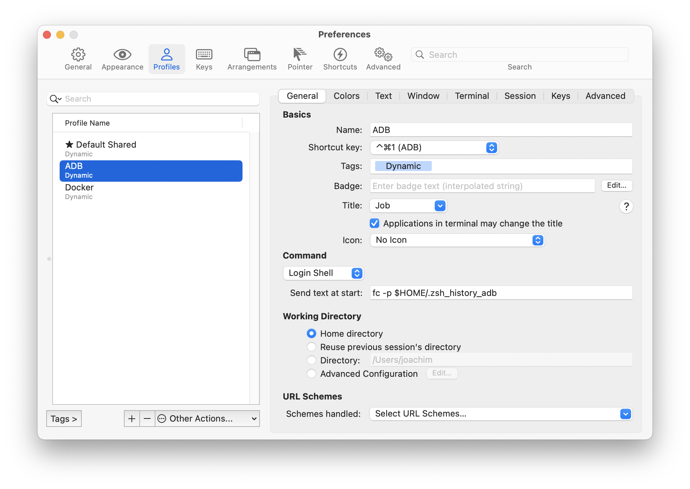

# iTerm2 (Dynamic) Profiles

[Dynamic profiles](https://iterm2.com/documentation-dynamic-profiles.html) are a great way to share iTerm2 profiles across multiple Macs.

I use the Profiles to have three separate profiles.

* Default Shared (to not confuse with the usual local `Default` Profile. I suggest deleting the local `Default` in any case, as you will not use it again.)
* ADB -> inherits all stuff from Default Shared but with different background color and a separate zsh history
* Docker - same intention as ADB, only with a separate history and a different background color to distinguish the terminal windows

That separate zsh history for ADB and Docker interactions is the key feature - as I do not want to mess up my usual shell sessions with the adb related stuff.

The ADB and Docker Profiles have a *Send text at start* with the command to have a different history file - here for ADB it is `fc -p $HOME/.zsh_history_adb`. 

# Customization 

The [iTerm2 Dymamic Profiles documentation](https://iterm2.com/documentation-dynamic-profiles.html) is quite clear on how to use that feature.

The Default.json contains the base Profile `Default Shared`.

The other Profiles in `Profiles.json` inherit from that Profile and set a different background color.

To update the `Default Shared` you can edit the settings, but they would be overridden. You have to export that changes via iTerm2 `Profiles` preferences as a new Default.json. So this new json can be used as the new Default.json.

Make sure that the `Guid` is the same as before.

For changes on the other Profiles in `Profiles.json` you have to use a text editor.

# References
Find some additional ideas for using Dynamic Profiles in [Shrey Banga's Blog -Little known features of iTerm2](https://banga.github.io/blog/2020/03/02/little-known-features-of-iterm2.html)

