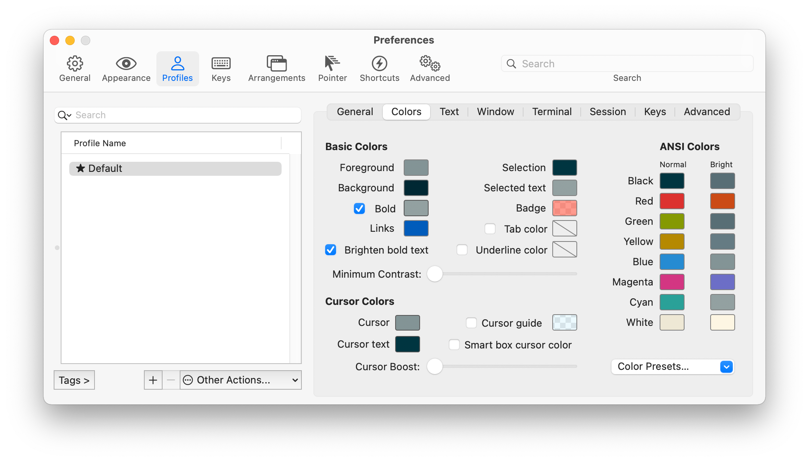
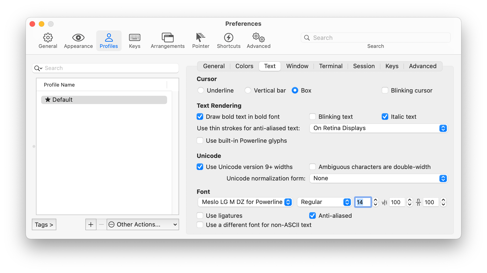
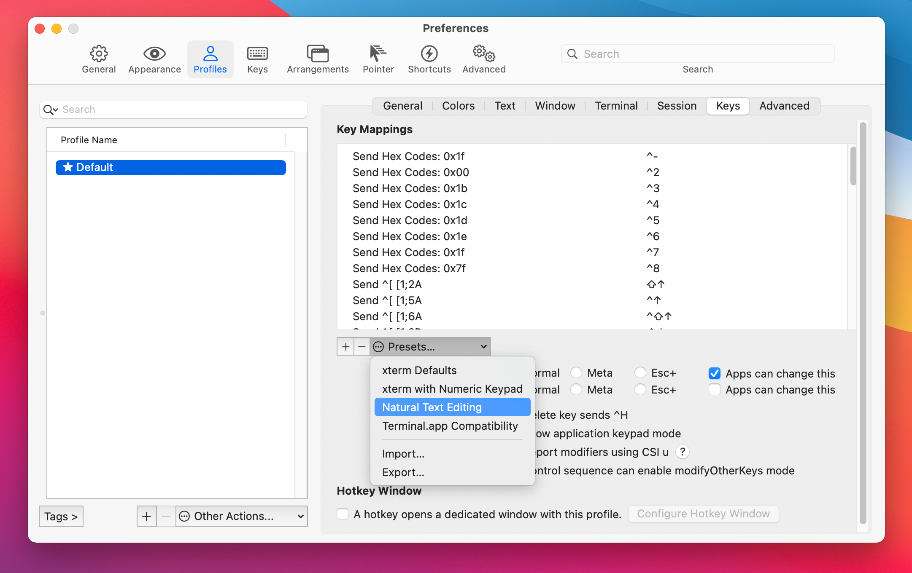

# Joachim Schuster's iTerm2 setup

Here's another of the ten thousand tutorials for beautifying the terminal experience on your Mac.

* **iTerm2** is a nice configurable Terminal https://iterm2.com (running the shell Zsh)
* **oh-my-zsh** provides themes and plugins for the shell zsh https://ohmyz.sh

For convenience I created an Makefile installer. This will install (**brew** if not installed before,) **iTerm2**, the required **font** and sets the Profiles to use the correct **color sheme**.

## Automatic installation of iTerm2

Just run `make install` in this folder.

```
make install
```

Continue with [Configure Zsh](#configure-zsh)  or use my managed zsh setup: [oh-my-zsh](../oh-my-zsh)

### Dynamic Profiles

One key feature of this setup ist the use of iTerm2's [Dynamic Profiles](https://iterm2.com/documentation-dynamic-profiles.html).

The Installer will link the two files `Default.json` and `Profiles.json` in the `Dynamic Profiles` folder. So changes on that files will automatically be shared accross the Mac that share the setup.

The Profiles contain the **font** ,**color sheme** and the custom **keys** setup.

The Default.json contains the base Profile `Default Shared`.

The other Profiles in `Profiles.json` inherite from that Profile and set a different background color.

To update the `Default Shared` you can edit the settings but they would be overridden. You have to export that changes via iTerm2 `Profiles` preferences as a new Default.json. So this new json can be used as the new Default.json.

Make sure that the `Guid` is the same as before.

For changes on the other Profiles in `Profiles.json` you have to use an text editor.

##  Manual installation of iTerm2

###  Install iTerm2
```
brew install iterm2
```

###  Download Color Scheme
```
cd ~/Downloads && {
    curl -fsSL 'https://raw.githubusercontent.com/mbadolato/iTerm2-Color-Schemes/master/schemes/Solarized%20Dark%20-%20Patched.itermcolors' -o 'SolarizedDark-Patched.itermcolors'
    cd -; }
```

###  Download and install Font
The Zsh theme `agnoster` https://github.com/agnoster/agnoster-zsh-theme requires a font that is *Powerline enabled*.

So here are 3 Fonts you might consider (one is enough to install). I use the  `Meslo LG M DZ for Powerline` in Size 14 in my iTerm2 setup.

The preferred way to install these fonts is using brew
first add the tap for cask-fonts wiht
```
brew tap homebrew/cask-fonts
```

then install the font family

```
brew install font-meslo-for-powerline
```

An alternative font fira code can be installed via

```
brew install font-fira-mono-for-powerline
```

#### Download and install Font without brew

Alternatively, you can download and install them individually, but without brew support (update/deinstall):

##### Meslo with Dotted Zero

As the name says, with a dot in the zero.

```
cd ~/Library/Fonts && {
    curl -fsSL 'https://github.com/powerline/fonts/blob/master/Meslo%20Dotted/Meslo%20LG%20M%20DZ%20Regular%20for%20Powerline.ttf?raw=true' -o 'Meslo LG M DZ Regular for Powerline.ttf'
    cd -; }
```

##### Meslo with Slashed Zero

As the name says, with a slath in the zero.

```
cd ~/Library/Fonts && {
    curl -fsSL 'https://github.com/powerline/fonts/blob/master/Meslo%20Slashed/Meslo%20LG%20M%20Regular%20for%20Powerline.ttf?raw=true' -o 'Meslo LG M Regular for Powerline.ttf'
    cd -; }
```

##### Fira Code
https://github.com/tonsky/FiraCode
```
cd ~/Downloads && {
    curl -fsSL -O 'https://github.com/tonsky/FiraCode/releases/download/5.2/Fira_Code_v5.2.zip'
    unzip Fira_Code_v5.2.zip -d Fira_Code
    cp Fira_Code/ttf/FiraCode-Regular.ttf ~/Library/Fonts
    rm -r Fira_Code
    rm Fira_Code_v5.2.zip
    cd -; }
```

###  Configure Color, Font and Keys in iTerm2
####  Color Scheme
- Go to `Preferences...` -> `Profiles` -> `Colors`
- Press `Color Presets...`
- Select `Import...`, select the downloaded 'SolarizedDark-Patched.itermcolors' file and confirm with `Open`
- Press `Color Presets...` again
- Select `SolarizedDark-Patched`


####  Font
- Go to `Preferences...` -> `Profiles` -> `Text`
- Select `Meslo LG M DZ for Powerline` (or that one you installed [previous](#download-and-install-font)) as Font and if you like increase the Font size to e.g. 14pt



####  Keys (navigation with cursor etc.)
To navigate with your cursors resp. with option + cursor to jump the words in your terminal session:

- Go to `Preferences...` -> `Profiles` -> `Keys` (not Preferences... > Keys)
- Press `Presets...`
- Select `Natural Text Editing` and confirm the dialog to `remove` all previous set keys


## Configure Zsh

I use my already prepared and managed zsh setup: [oh-my-zsh](../oh-my-zsh). 
But to get the whole zsh setup initially, follow the next steps.

###  Install oh-my-zsh
To install oh-my-zsh execute the following command
```
sh -c "$(curl -fsSL https://raw.githubusercontent.com/robbyrussell/oh-my-zsh/master/tools/install.sh)"
```
After the installation your `~/.zshrc` has been created or modified.
You can edit the file like
```
nano ~/.zshrc
```

###  Configure Theme
In `~/.zshrc` change the value of the variable `ZSH_THEME` to `agnoster`
```
ZSH_THEME="agnoster"
```

###  Download and activate zsh plugins
####  Fish shell like syntax highlighting for zsh
https://github.com/zsh-users/zsh-syntax-highlighting
```
brew install zsh-syntax-highlighting
```

In `~/.zshrc` add the following line at the end to activate the plugin
```
source $(brew --prefix)/share/zsh-syntax-highlighting/zsh-syntax-highlighting.zsh
```

####  Fish-like fast/unobtrusive autosuggestions for zsh
https://github.com/zsh-users/zsh-autosuggestions#oh-my-zsh
```
brew install zsh-autosuggestions
```

In `~/.zshrc` add the following line at the end to activate the plugin
```
source $(brew --prefix)/share/zsh-autosuggestions/zsh-autosuggestions.zsh
```

## Do not show username @ hostname
In `~/.zshrc` add the following line (right below the `ZSH_THEME` variable)
```
DEFAULT_USER="$USER"
```

